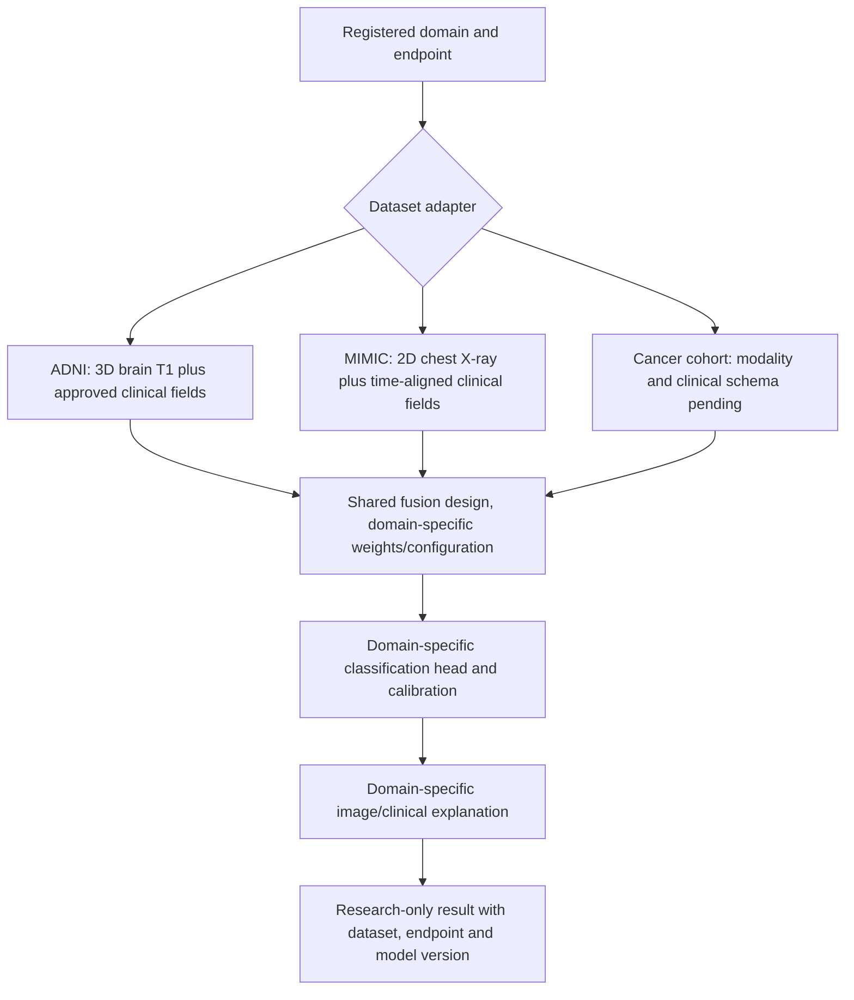

# Review of proposed multi-dataset architecture

**30 September 2026 — proposal under review; not the current finalized experiment design.** The user supplied a diagram with three branches: ADNI MRI + clinical data, MIMIC chest X-ray + clinical data, and a cancer image + clinical cohort. The diagram proposes image preprocessing, Swin Transformer, clinical preprocessing, Clinical Transformer, bidirectional cross-attention, a multimodal Transformer, classification, and image/clinical explanations. The **cancer task is now selected as breast lesion malignancy classification (benign versus malignant)**; CMMD mammography is the candidate dataset pending cohort/feature audit. The MIMIC diagnosis remains undecided. No application or model implementation has started.

## What the diagram can mean scientifically

The reusable idea is an **image-plus-tabular fusion pattern**. It does not make ADNI, MIMIC and a cancer cohort one statistical dataset. They involve different organs, image geometries, clinical columns, disease endpoints, labels and data-use rules. A single shared classification head cannot have a meaningful common class list until a scientifically justified task mapping is specified. A more defensible software design routes a case to a registered domain-specific experiment:

The **design pattern** can be shared; image dimensionality, preprocessing, pretrained weights, feature schema, missingness handling, labels, head, calibration and checkpoint are task-specific unless transfer across domains is separately tested. The first experiment in each domain should compare image-only, clinical-only and simple concatenation against attention variants. Swin, Clinical Transformer, bidirectional attention and a post-fusion Transformer remain **hypotheses**, not fixed necessities; smaller datasets may support only a simpler model.

## Dataset and target audit

| Diagram branch | Verified source facts | Missing decision / consequence |
|---|---|---|
| **ADNI** | Official [ADNI data](https://adni.loni.usc.edu/data-samples/adni-data/) includes structural MRI and clinical assessments under approved IDA access. Its [diagnosis guide](https://adni.loni.usc.edu/quick-start-guide-asset101625/diagnostic.html) maps `DXSUM.DIAGNOSIS` to CU, MCI and dementia; dementia is not automatically AD. | Keep current baseline CU/MCI/dementia proposal until access and field audit. Cognitive scores used in diagnosis must be reviewed as label proxies. |
| **MIMIC-CXR plus MIMIC-IV** | [MIMIC-IV documentation](https://physionet.org/content/mimiciv/3.1/) says linkage to MIMIC-CXR uses `subject_id` and aligned dates, with selection bias. [MIMIC-CXR-JPG](https://physionet.org/content/mimic-cxr-jpg/2.1.0/) contains report-derived labels and requires credentialed access and a DUA. A [prelinked Symile-MIMIC dataset](https://physionet.org/content/symile-mimic/1.0.0/) offers 11,622 admissions with CXR, ECG and blood labs, but was created for **retrieval**, not a validated disease diagnosis endpoint. | Select **one chest condition and label source** first. Report-derived CXR labels are weak supervision, not automatic clinical ground truth. Register a prediction time; forbid radiology reports and post-index labs as predictors. Access/CITI/DUA review is required. |
| **Cancer** | The [TCIA TCGA-BRCA collection](https://www.cancerimagingarchive.net/collection/tcga-brca/) links breast cancer MR/mammography images to clinical/pathology data at GDC; [GDC viewer](https://docs.gdc.cancer.gov/Data_Portal/Users_Guide/IDCViewer/) can show pathology slides. The cited TCGA-BRCA cohort consists of **breast cancer cases**, so it does not by itself define a cancer-versus-healthy screening task. | Specify organ, image type (mammogram/CT/MRI/histopathology), clinical input, exact endpoint, and source. “Tumor stage” is a potential **target or post-diagnosis proxy**, not automatically a safe predictor. Whole-slide pathology demands patch/slide/patient grouping and much more storage/compute. |

No MIMIC or cancer endpoint should be selected merely from the diagram. In particular, “pneumonia” would need an explicit label and uncertainty policy; “breast cancer diagnosis” would need benign/non-cancer comparison data rather than only tumor cases. Each branch needs a feasible paired cohort count **after** access, date matching and QC.

### Selected cancer task (30 September 2026; dataset feasibility pending)

**Predict whether an imaged breast lesion is benign or malignant from mammography plus eligible pre-diagnosis clinical variables.** The public [CMMD collection at TCIA](https://www.cancerimagingarchive.net/collection/cmmd/) is the first dataset candidate: it reports 1,775 patients, 22.86 GB of mammograms, demographic/clinical supporting data, and benign or malignant breast disease. The [IDC collection record](https://portal.imaging.datacommons.cancer.gov/collections/cmmd/) describes the labels as biopsy-confirmed. This task is **lesion malignancy classification in a selected cohort**, not screening of the general population or identification of cancer type. It also changes the diagram's illustrative histopathology image to mammography for this branch. See ADR-013.

Before adoption, audit the downloadable clinical table column by column. Keep only information available before the diagnostic label; do not use pathology, molecular subtype, or image-derived abnormality descriptions as independent clinical predictors in the primary model. Verify per-class patient counts, missingness, linkage, access and cloud download terms, and CPU/GPU memory fit. If independent clinical variables are too sparse for a meaningful clinical encoder, report that limitation and reconsider the cohort rather than fabricate a multimodal claim. This recommendation does **not** finalize the cancer branch or authorize model implementation.

**Initial workbook audit:** the [CMMD acquisition audit](../data/cmmd_download_audit.md) found that age is the only obvious independent pre-diagnosis variable in the official spreadsheet. CMMD does not presently justify the diagram's Clinical Transformer for this branch. The benign/malignant task remains selected, but a richer paired dataset is needed if that encoder is a required contribution.

## Evaluation and explanation rules

1. Split by participant within each source before image patching, augmentation, imputation or tuning; keep admissions, scans and visits from one patient together.
2. Report **separate** per-domain class definitions, prevalence, AUROC/AUPRC, sensitivity/specificity, calibration and uncertainty intervals. Never average disease probabilities or accuracy across unrelated labels as a single performance claim.
3. Use dataset-specific image attribution that maps back to the original 2D/3D anatomy. An attention weight is not a causal heatmap. Clinical SHAP or another attribution method needs an explicit baseline and feature provenance.
4. Compare resource cost of 3D MRI, 2D chest X-ray and any whole-slide cancer modality separately. A ₹0 cloud target and no local machine remain unproven for all three, especially whole-slide pathology.
5. Treat each source's access agreement separately. ADNI, MIMIC/PhysioNet and cancer repositories do not share one universal permission.

## Decision needed before promoting this proposal

The cancer task is selected, with CMMD candidate feasibility still to be audited. The MIMIC chest endpoint remains undecided. The next research phase must verify candidate cohorts and labels, expand the 2024–2026 literature review beyond its Alzheimer focus, recalculate base-paper similarity for a **framework** rather than one disease, and revise the dataset strategy, mathematical formulation, experiment plan, requirements, API/UI, privacy and feasibility documents. Only then can this proposal replace the existing [single-domain architecture](system_architecture.md). See [ADR-012 and ADR-013](../decisions/architecture_decisions.md).

**Implementation status: NOT STARTED.**
