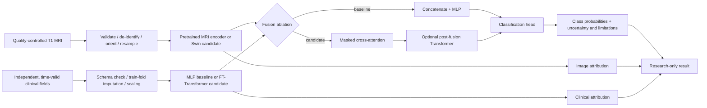

# Research architecture specification (no implementation yet)

**Status: research design finalized; trained variant undecided.** The first trainable model is MRI encoder + clinical MLP/FT-Transformer + simple fusion; cross-attention and a post-fusion Transformer are evaluated as ablations. This order follows architectural overlap with OmniBrain `[2]`, TriFusion `[1]`, MAMDF `[3]`, NeuroNet-AD `[27]` and AD-Transformer `[4]`, while acknowledging that the dataset and CPU budget may require a smaller model. No component is declared superior before experiments. The specific checkpoint architecture is an experiment result, not a literature-only decision.

## Detailed flow and tensor contracts

One subject/visit yields MRI `X_img ∈ R[B,1,D,H,W]` and clinical feature values `X_clin ∈ R[B,F]` plus masks `M ∈ {0,1}[B,F]`. Chosen voxel dimensions `D,H,W` and feature count `F` depend on cohort/QC and memory profiling. Image encoder emits `I ∈ R[B,N_i,d]` tokens or a pooled vector. Clinical feature tokenizer emits `C ∈ R[B,N_c,d]`; an MLP baseline emits one vector. Do not describe one clinical vector as richly tokenized cross-attention. Padding and missing-feature masks must be applied to attention logits. A pooled fused state `z ∈ R[B,d]` goes to `K` logits and softmax probabilities, where `K` is the registered label count.

## Preprocessing

MRI: accept only specified DICOM/NIfTI study type; reject corrupt or unrecognized files; remove/avoid direct identifiers; orient to a canonical axis; validate voxel spacing and scan QC; resample/crop using train-defined settings; intensity normalize without peeking at held-out data. Avoid slice-level random split. Clinical: validate schema, units, range, collection time and missing codes; impute and scale with training-only fitted objects; encode categories with an unknown state. Log aggregate validation failures, not raw filenames or patient values.

## Fusion and prediction

Run five matched variants: image only, clinical only, concatenation, cross-attention, and cross-attention plus multimodal self-attention. Preserve comparable encoders and training budget. Bidirectional cross-attention is optional and must be justified by sample size. Use class-weighted cross-entropy only when training imbalance warrants it; estimate calibration on validation data after model selection. A low-confidence or out-of-scope sample returns an abstention message rather than a diagnostic assertion.

## Explainability and inference

For a compatible convolutional MRI encoder, test Grad-CAM; for a pure token encoder use a validated gradient/token attribution method with image-space alignment. Use SHAP on the clinical branch or a bounded approximation over the full predictor; show baseline and feature source. Attention maps are not causal. Inference loads a versioned checkpoint once, validates payload, preprocesses, predicts, optionally explains, then deletes temporary upload bytes. Unsupported sequence, missing required variables, failed QC, model-unavailable and timeout states return structured errors. History, if ever enabled, stores only non-identifying summaries with explicit retention; default is no server-side history.

## Decision gates

Swin and post-fusion Transformer remain conditional. Adopt them only when paired-cohort validation improves a pre-registered primary metric or calibration enough to justify measured memory and latency. Dataset access and cloud DUA review precede any real-data training. See [math](mathematical_formulation.md), [experiments](../ml/experiment_plan.md), and [ADR log](../decisions/architecture_decisions.md).
